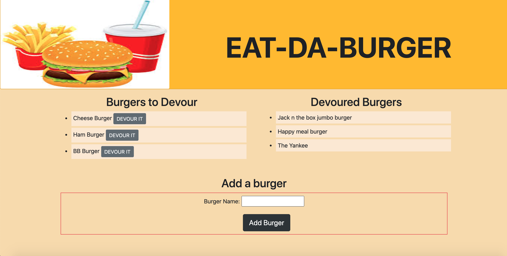

# Eat-Da-Burger

## Table of Contents

* [Description](#description)
* [Installation](#installation)
* [Deployed Application](#application)
* [Screenshots](#screenshots)

## Description 

This repository consists of code for a burger restaurant, where user is allowed to enter a burger name they like, button to devour it. This application used MVC architecture and follows REST protocol. MYSQL database is used for presisting data. Node's express is used for routing and express-handlebars are used for rendering html. CSS is used for styling and java script is use to implement event listering and making ajax calls to server. 

Git is used for version controlling and for periodic commits to Gitlab.

## Installation

Execute ``` npm install ``` command in terminal(Mac) or command promt(windows) to install all needed packages to run this application successfully.

Run ``` npm run start ``` command in terminal(Mac) or command promt(windows) to start the application.


## Application

The application is deployed in heroku and can be found at https://vast-springs-92238.herokuapp.com/


## Screenshots
<br>